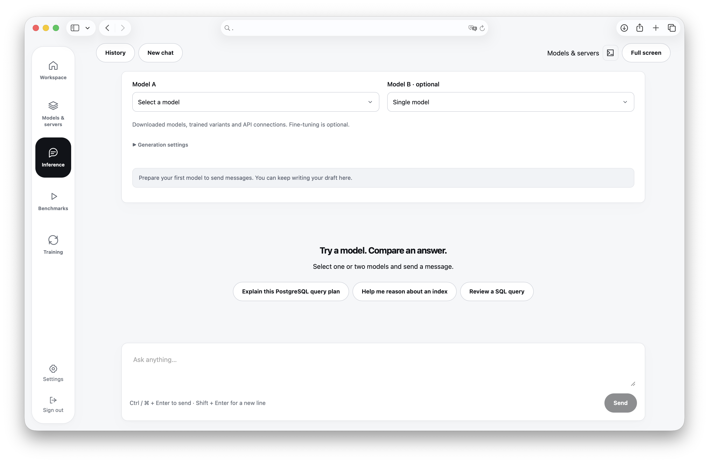

# Postgres Gym

A self-hosted workspace for PostgreSQL agent benchmarks, GRPO training, model evaluation and vLLM inference.

The Python library runs the tasks. The web application and the `pg-gym` CLI sit on one REST API and one durable job queue, so a benchmark started from a browser tab and one submitted from CI end up in the same place with the same record. The platform targets one Linux host with local SQLite storage, trusted account holders, Docker and optional NVIDIA GPUs.



## Installation

You need Python 3.12, uv, Docker Engine and Docker Compose v2. For GPU jobs add a compatible NVIDIA driver and the NVIDIA Container Toolkit. Everything is built from this repository, no container images are published.

```sh
uv tool install .
```

That gives you the `pg-gym` command with the library and the remote client. Hosting the API and the worker needs Docker and a full checkout, because the frontend is built from source.

## Start the platform

```sh
pg-gym platform start --source .
pg-gym platform registration-code
```

`platform start` creates the instance directory if it is missing, builds the images and waits for the services to become healthy. Running it again keeps the data and the secrets. Open `http://localhost:9432`, create an account with the code, and add a model connection in Settings. Keys are encrypted on the API server and the browser never receives a saved key.

The CPU worker can chat with remote models and import Hugging Face models right away. Benchmarks also need the task image, see [The platform](platform.md#the-task-image).

## First benchmark

The same platform from a terminal.

```sh
pg-gym context add local --url http://localhost:9432
pg-gym auth login --username alice
pg-gym connections list
pg-gym benchmark submit sql-function-set --task area --harness opencode --connection CONNECTION_ID --wait
```

`--wait` blocks until the job ends and exits non-zero when it fails. The job itself lives on the platform, so closing the terminal does not stop it.

## Where to go next

* [The platform](platform.md) covers the instance, the task image, GPUs, HTTPS and backups.
* [The workspace](workspace.md) walks through the web application.
* [Benchmarks](benchmarks.md) explains suites, harnesses and what a result means.
* [Models and inference](inference.md) imports models, serves them with vLLM and chats.
* [Training](training.md) trains with GRPO and evaluates on held-out tasks.
* [Collecting trajectories](collect.md) records teacher runs for supervised fine-tuning.
* [The CLI](cli.md) is the reference for contexts, output formats and exit codes.
* [Python library](library.md) runs tasks without a platform.
* [REST API](rest-api.md) is the contract behind all of it.
